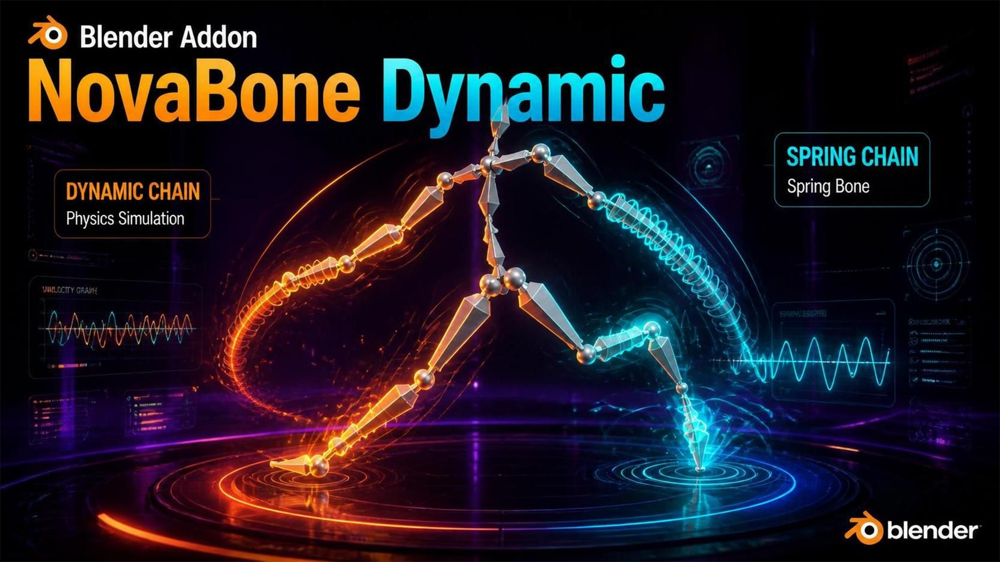

# 🦴 NovaBone Dynamics



**뼈 체인 물리 시뮬레이션 애드온** — 머리카락, 꼬리, 스커트, 액세서리, 지글본을
클릭 몇 번으로 자동 물리 애니메이션으로 만들어 줍니다.

**제작자: Chamiseul**

[🇺🇸 English](./index.md) | 🇰🇷 한국어

---

## ✨ 주요 기능

- ✅ 체인 시작~끝만 지정하면 자동 시뮬레이션
- ✅ 스케일 독립 — 블렌더 릭(1.0)도 언리얼 릭(0.01)도 같은 값으로 동일한 움직임
- ✅ 충돌 셰이퍼를 눈으로 보면서 튜닝
- ✅ **형태 정밀 충돌**: Capsule / Cylinder / Box가 단순 표시가 아니라
  실제 볼륨으로 충돌 계산 (멀티 접촉 + 스윕 CCD 터널링 방지)
- ✅ **안정적인 접촉**: 안티폴드(뼈가 뒤집혀 접히는 현상 차단) +
  안티키ink(드레이프 체인의 지그재그 자동 완화)
- ✅ 체인 모드 + 스프링(지글본) 모드
- ✅ Blender 클로스/헤어 시뮬레이션 충돌체 연동
- ✅ 게임 엔진 반출용 베이크


*▲ N패널의 NovaBone 메인 패널 — 모든 설정이 이 한 곳에 모여 있습니다*

---

## 📥 설치

1. `novabone` 폴더 안의 **파일들을 선택해서** zip으로 압축
   > ⚠️ 폴더째 압축하지 마세요. `blender_manifest.toml`이 zip 최상위에 있어야 합니다.
2. Blender → `Edit > Preferences > Get Extensions`
3. 오른쪽 위 `▼` → **Install from Disk** → zip 선택
4. 설치된 NovaBone을 **Enable(활성화)**
5. 3D 뷰포트에서 `N` 키 → **NovaBone** 탭이 생깁니다

**지원 버전**: Blender 4.2 이상 (5.0 / 5.2 LTS 테스트 완료)

---

## 🚀 5분 안에 따라하기 (Quick Start)


*▲ 뼈 선택 → 체인 생성 → 재생. 이게 전부입니다.*

1. 아머처 선택 후 **포즈 모드** 진입
2. 물리를 넣고 싶은 뼈들을 전부 선택
   (연결된 꼬리라면: **뿌리 뼈를 마지막에 클릭**, 나머지는 Shift+클릭)
3. N패널 → **Setup Tools** → `Chains from Selection` 클릭
4. 뼈가 살짝 늘어지면 성공! **스페이스바**로 재생
5. 몸 뼈를 움직이면 체인이 물리적으로 따라 흔들립니다 🎉

> 💡 **Shake & Play** 버튼은 뼈를 흔들고 + 재생까지 자동으로 시작합니다.
> 출렁이면 엔진 정상입니다.

---

## 🧭 패널 구조

| 섹션 | 역할 |
|---|---|
| **NovaBone Enabled** | 애드온 전체 스위치 |
| **NovaSol Solver** | 물리 품질·테스트 도구 |
| **Forces** | 중력·바람 |
| **Unit Normalization** | 릭 스케일 보정 |
| **Setup Tools** | 체인 만들기 |
| **Armature** | 오브젝트별 설정 |
| **Chains** | 체인별 상세 물리 |
| **Bake & Reset** | 베이크·리셋 |

---

## 1️⃣ NovaBone Enabled

가장 위의 큰 버튼. **ON이어야 물리가 작동합니다.** 체인 생성 시 자동 ON.
OFF면 물리가 멈추고 애니메이션 원본대로 재생됩니다.

---

## 2️⃣ NovaSol Solver (물리 품질)

| 항목 | 설명 | 권장값 |
|---|---|---|
| **Substeps** | 프레임 1장을 몇 조각으로 나눠 계산. 높을수록 부드럽고 단단하고 **충돌 아티팩트도 줄어듦** | 8 (접촉 많거나 빠른 장면 10~16) |
| **Iterations** | 제약(길이·각도) 반복 계산 횟수 | 3 |
| **Time Scale** | 물리 시간 속도 (2 = 두 배 빠름, 0.5 = 슬로모션) | 1.0 |

| 버튼 | 역할 |
|---|---|
| **Simulate 1 Step** | 현재 프레임에서 딱 1프레임만 진행 (미세 확인) |
| **Shake & Play** | 뼈를 랜덤하게 흔들고 **자동 재생 시작**. 재생 중 다시 누르면 정지 |
| **Diagnostics** | 엔진 상태·숨은 오류 표시. **문제 발생 시 가장 먼저 클릭** |

> ⚠️ 물리는 **프레임이 바뀔 때** 계산됩니다. 정지 상태에서 안 움직이는 건 정상입니다.

### 🎯 충돌 정밀 엔진 (v1.0.0)

NovaSol의 충돌은 더 이상 뼈당 구 1개가 아닙니다. 매 서브스텝마다:

1. **볼륨 프로빙** — 체인에서 고른 Shape(Capsule / Cylinder / Box)를
   **실제 볼륨** 따라 제한된 수의 구 프로브로 샘플링합니다: 캡슐은 척추선,
   실린더는 측면 링, 박스는 모서리 오프셋까지. 뼈 중간이 벽을 비집고
   지나가던 누수와 "Box인데 둥글게 밀려나던" 문제가 사라졌습니다.
2. **멀티 접촉** — 서로 다른 최대 3개 접촉(법선이 60° 이상 차이)을 동시
   해결: 가장 깊은 접촉은 100%, 나머지는 60% 강도로 밀어냅니다. 모서리에
   걸친 뼈가 한쪽 벽에서만 떨리지 않고 양쪽 모두에 안착됩니다.
3. **스윕 CCD** — 한 서브스텝에 충돌 반경의 절반 이상 이동한 뼈는
   **이동 경로 자체**를 검사해 마지막 안전 지점으로 되돌립니다. 빠른
   휘두름이 얇은 판을 순간 통과하는 터널링이 잡힙니다.
4. **안티폴드** — 모든 접촉 보정에는 예산이 있습니다(라운드당 뼈 길이의
   최대 75%) + 방향 클램프(라운드당 최대 45°). 뼈가 한 번에 뒤집혀
   접히는 것은 구조적으로 불가능하며, 대신 몇 프레임에 걸쳐 표면을
   미끄러져 내려갑니다.
5. **안티키ink** — 접촉 해결 후, 체인 중간 뼈들의 방향을 이웃 뼈 평균
   방향으로 15%씩 완만히 혼합(Chain 모드만)합니다. 구 위에 드레이프된
   체인의 지그재그 꺽임이 몇 프레임 안에 자연스럽게 펴집니다.
6. **잔여 재검사** — 클램프/예산 절단이 발동한 뼈만(평시엔 0회) 충돌
   라운드 끝에 쿼리 1회 + 작은 외부 밀어냄을 추가해, 라운드가 항상
   표면 **바깥에서** 끝나도록 보장합니다.

> 💡 전부 자동입니다 — 새 슬라이더 없음. 패널 하단 `Solve xx ms`가
> 오르면 Substeps를 먼저 낮추세요. 프로브 밀도가 좋아져서 예전만큼
> Substeps가 필요 없습니다.

---

## 3️⃣ Forces (중력·바람)

### Gravity

| 모드 | 설명 |
|---|---|
| **Custom (Normalized)** | 기본. 벡터 직접 입력 (기본 0,0,-9.81). 스케일 무관 동일 느낌 |
| **Scene Gravity** | 씬 중력 설정 사용 |
| **Zero** | 무중력 |

### Procedural Wind (내장 바람)


*▲ 바람 ON + 재생만으로 머리카락이 계속 살랑입니다*

| 항목 | 설명 |
|---|---|
| **Strength** | 바람 세기 (6~10이면 확실히 보임) |
| **Direction** | 바람 방향 |
| **Turbulence** | 난기류 — 높을수록 랜덤 출렁임 |
| **Noise Scale** | 패턴 크기. 낮으면 큰 물결, 높으면 잘게 |

> 💡 재생만으로 지속 움직임을 원하면 바람을 켜세요.

---

## 4️⃣ Unit Normalization ⭐ (스케일 문제 해결)

**"블렌더 릭은 뼈 길이 1.0, 언리얼 임포트는 0.01이라 같은 값이 안 먹는다"**
는 고질 문제의 해결 기능. 모든 물리량을 **기준 뼈 길이(L)로 나눈 정규화
공간**에서 계산하므로 같은 값 = 어떤 스케일에서든 동일한 움직임.

| 항목 | 설명 |
|---|---|
| **Auto Detect** | 기본. 체인 뼈 길이 중간값을 자동 기준으로 사용. **대부분 이대로면 끝** |
| **Manual** | 기준 길이 직접 입력 |

**스케일 프리셋**: `Blender 1.0` / `Unreal 0.01` 버튼 한 번 클릭으로 끝.


*▲ 아래 표시되는 `Median bone length`가 자동 감지된 기준값입니다*

---

## 5️⃣ Setup Tools (체인 만들기)

### Bone Prefix (접두사) — 게임 릭 추천


*▲ dyn_ 뼈들이 한 번에 체인화됩니다*

1. **Prefix**에 접두사 입력 (기본 `dyn_`)
2. **Chains from Prefix** 클릭
3. 접두사 뼈 전부 자동 체인화

| Mode | 동작 |
|---|---|
| **Group Chains** | 연결된 dyn_ 뼈들은 하나의 체인으로 (권장) |
| **Individual Bones** | 각각 독립 1뼈 체인 (액세서리 다수에 유용) |

### Chains from Selection

1. 포즈 모드에서 뼈 선택 — **뿌리 뼈를 마지막에 클릭**
2. 버튼 클릭

| Mode | 동작 |
|---|---|
| **Auto** | 경로가 있으면 체인, 없으면 개별 체인 자동 처리 (권장) |
| **Chain to Active** | 활성 뼈 아래로 연결된 것만 |
| **Individual Bones** | 선택 뼈 각각 독립 체인 |

> ✅ **뼈 1개만 선택해도 됩니다**: 뼈를 딱 1개 선택하고 실행하면
> 1뼈 체인(Start = End = 그 뼈)이 생성됩니다. 더 이상
> "No chain created" 경고가 나오지 않습니다. Auto 모드에서 활성(뿌리)
> 뼈가 조용히 빠지던 문제도 수정되었습니다.

> 💡 **액세서리 여러 개 한 번에**: 목걸이·귀걸이 뼈들을 전부 선택하고 Auto로
> 실행하면 각자 개별 체인이 되어 한꺼번에 물리가 걸립니다.

### Detect Chains Automatically

선택 없이 **자식 없는 끝 뼈(팁)를 자동으로 찾아** 연속 구간을 체인화.
릭 구조를 몰라도 됩니다.

| 버튼 | 역할 |
|---|---|
| **Add Empty Chain** | 빈 체인 추가 (Start/End 수동 입력용) |
| **Prune Invalid Chains** | 깨진 체인 일괄 정리 |
| **Copy Active Chain Settings** | 활성 체인 설정을 다른 모든 체인에 복사 |
| **Resolve From Start/End** | Start/End 뼈 이름만으로 경로 자동 완성 |
| **Select Chain Bones** | 체인 뼈들을 뷰포트에서 선택 |

---

## 6️⃣ Armature 섹션

| 항목 | 설명 |
|---|---|
| **Enable Armature** | 이 아머처 물리 ON/OFF |
| **Mute Armature** | 일시 정지 |
| **Freeze (Post-Bake)** | 베이크 후 물리 중단 (결과 보존) |
| **Show Bone Shapes** ⭐ | **충돌 셰이퍼 표시** |
| **Self Collision** | 체인 뼈들끼리 서로 밀어냄 |

### Show Bone Shapes — 충돌 셰이퍼 ⭐


*▲ 캡슐이 본 헤드~테일에 정확히 걸쳐서 함께 움직입니다. Radius를 올리면 지름이 커집니다*

**셰이퍼는 새 뼈가 아닙니다.** 뼈의 충돌 범위를 **눈으로 보여주는 시각화 메쉬**입니다.

- Capsule / Cylinder / Box 중 선택
- **Radius** = 충돌 두께 (뼈 길이 대비 비율 — 스케일 무관)
- 재생 중에도 물리 뼈에 픽셀 단위로 정확히 부착
- Blender Simulation 엔진에서는 이 셰이퍼가 **실제 충돌체** 역할
- NovaSol 엔진에서도 이제 고른 Shape가 **실제 충돌 볼륨**으로 사용됩니다
  (위 충돌 정밀 엔진 참고)

> 💡 튜닝 절차: Show Bone Shapes ON → Radius 조절 → 캡슐이 몸에 살짝
> 겹치는 지점이 "충돌 시작 지점"입니다.

---

## 7️⃣ Chains (체인별 설정)

체인 박스의 `▼`를 눌러 펼칩니다.

**체인 행 헤더**: `[▼] [이름] [🎯선택] [✓ 시뮬ON/OFF] [🔇 음소거] [X 삭제]`

> 🎯 **체인별 선택 버튼** — 체인이 10~20개 이상 나열되어도 각 행의
> 선택 버튼을 누르면 **그 체인의 뼈만** 뷰포트에서 선택되고, 동시에 그
> 체인이 활성 체인이 됩니다(이어서 Preset/설정 복사를 누르면 클릭한 그
> 체인에 적용). 어떤 체인이 어떤 뼈인지 더 이상 추측할 필요 없습니다.

### 🎵 Motion (움직임 타입)


*▲ 위: Chain(부드럽게 복귀) / 아래: Spring(통통 출렁이며 복귀)*

| Type | 설명 |
|---|---|
| **Chain (Positional)** | 기본. 안정적인 위치 기반 물리. 오버슈트 없음. 안티키ink 스무딩 적용 |
| **Spring (Force)** | **스프링 지글본**. 통통 튀며 여러 번 출렁. 가방·가슴·배에 최적 |

| 항목 | Chain에서 | Spring에서 |
|---|---|---|
| **Stiffness** | 목표 추적 강도 | 스프링 상수 k |
| **Damping** | 속도 감쇠 | 속도 저항 c (낮을수록 오래 출렁) |
| **Taper Along Chain** | 끝으로 갈수록 말랑 (ON 권장) | 동일 |
| **Influence** | 0=애니메이션, 1=물리, 중간=블렌딩. **충돌 장면에서는 반드시 1.0** — 최종 포즈가 (1−influence) 비율로 원본 애니와 섞이므로 0.34면 구를 뚫는 원본 포즈가 66%나 보입니다 | 동일 |
| **Stretch** | 뼈 늘어남 허용치 (0.2 = ±10%). **충돌 장면에선 0 권장** | 동일 |
| **Gravity / Mass** | 중력 배율 / 무게감 | 동일 |

### 📐 Limits

| 항목 | 설명 |
|---|---|
| **Cone Limit** | 뿌리 기준 최대 꺾임 각도 |
| **Per-Axis Limits** | X/Z 축별 제한 (스커트 등) |

### 🥚 Bone Collision Shape

| 항목 | 설명 | 접촉 장면 권장값 |
|---|---|---|
| **Shape** | Capsule(권장) / Cylinder / Box — **세 모양 모두 NovaSol에서 실제 형태로 충돌** | Capsule |
| **Radius** | 충돌 두께 (비율 — 스케일 무관) | 0.18~0.25 |
| **Enable Collision** | 이 체인의 충돌 ON/OFF | ON |
| **Margin** | 반경 바깥 여유 두께 | 0.02~0.05 |
| **Friction** | 접촉 시 접선 속도 감쇠 | 0.4~0.6 |
| **Bounce** | 접촉 반발 | 0.05~0.15 (높으면 꺽임 재발) |

### ⚙️ Collision Engine


*▲ NovaSol 충돌: 팔을 움직이면 머리카락이 몸에서 밀려납니다*

| Engine | 설명 |
|---|---|
| **NovaSol (Viewport)** | 내장 솔버가 실시간 밀어냄 — 볼륨 프로빙, 멀티 접촉, 스윕 CCD, 안티폴드, 안티키ink 전부 적용. **Collide With** = Mesh Object 또는 Collection |
| **Blender Simulation** | 셰이퍼가 **진짜 블렌더 충돌 오브젝트**로 변신. 클로스·헤어 시뮬이 자동 충돌. 클로스/헤어 상호작용의 최고 정밀도 경로는 여전히 이쪽 |

**Blender Simulation Profile**: Hair(얇은 껍질·저마찰) / Cloth(두꺼운 껍질·고감쇠) / Custom

**External Targets**: 본이 붙은 **자기 옷이 아니라** 상대 캐릭터·바닥·다른 의상 등
**외부 충돌체** 지정. `Add GN Collider to Targets`로 공식 Collider 수정자 추가.

> ⚠️ **클로스 연동 순서**: ① Show Bone Shapes ON ② 옷에 Cloth 수정자
> ③ Cloth의 **Cloth Collisions 체크** ④ 재생

### 🎈 Floating Head

`Use Connect`가 꺼진 분리 뼈(장신구 등)의 **머리 끝도 물리로 시뮬**합니다.

| 항목 | 설명 |
|---|---|
| **Simulate Head** | 헤드 시뮬 ON |
| **Head Stiffness** | 원위치로 당기는 힘 |
| **Head Max Offset** | 최대 이탈 거리 (0 = 무제한) |

---

## 8️⃣ Bake & Reset


| 버튼 | 설명 |
|---|---|
| **Bake NovaBone to Keyframes** | 재생 구간 전체를 시뮬해 **키프레임으로 굽기**. 게임 엔진 반출 필수. Preroll로 시작 전 안정화 |
| **Unfreeze All Armatures** | 베이크 후 Freeze 해제 |
| **Reset Physics (Active)** | 활성 아머처 물리 초기화 |
| **Reset All Physics** | 씬 전체 초기화 |

---

## 🎨 프리셋 가이드

| 프리셋 | 느낌 | 용도 |
|---|---|---|
| **Hair** | 부드럽게 흘러내림 | 머리카락 |
| **Jelly** | 젤리 출렁임 | 뚱한 장식 |
| **Cloth** | 천처럼 느슨 | 스카프, 리본 |
| **Tail** | 둥글게 휘어짐 | 꼬리 |
| **Accessory** | 단단하게 흔들림 | 귀걸이, 목걸이 |
| **Antenna** | 거의 안 휘어짐 | 안테나, 깃털 |
| **Jiggle** | 크게 처지고 출렁 | 가슴, 배 |
| **Spring** ⭐ | 스프링처럼 통통 | 스프링 지글본 |

---

## 📋 시나리오 레시피

<details>
<summary><b>👱 머리카락</b></summary>

1. 머리 뼈 선택 (뿌리 마지막 클릭) → `Chains from Selection`
2. Preset: **Hair**
3. Show Bone Shapes ON → Radius 조절
4. Collision: NovaSol + 몸통 메시 지정, **Influence 1.0**, Bounce 0.1, Margin 0.03
5. 재생해서 팔이 머리를 스칠 때 밀려나는지 확인

</details>

<details>
<summary><b>👝 액세서리 여러 개</b></summary>

1. 액세서리 뼈 전체 선택 → `Chains from Selection` (Auto)
2. 하나 튜닝 후 **Copy Active Chain Settings**로 전체 복사
3. 각 행의 🎯 선택 버튼으로 어떤 체인이 어떤 뼈인지 바로 확인

</details>

<details>
<summary><b>🎒 스프링 가방</b></summary>

1. 가방 체인 생성 → Preset: **Spring**
2. Shake & Play → 통통 출렁임 확인
3. Damping ↑ = 빨리 잠잠

</details>

<details>
<summary><b>🩳 스커트</b></summary>

1. Prefix가 있으면 `Chains from Prefix`
2. Preset: **Cloth**
3. Cone Limit 60~70°
4. Self Collision ON (치맛자락 겹침 방지)

</details>

<details>
<summary><b>🧵 클로스 연동</b></summary>

1. Engine = **Blender Simulation**, Profile = **Cloth**
2. **Show Bone Shapes ON**
3. 옷에 Cloth 수정자 → **Cloth Collisions 체크**
4. 재생

</details>

<details>
<summary><b>⛓️ 구/몸통 위에 체인 드레이프시키기 (접촉 튜닝)</b></summary>

1. Influence **1.0**, Stretch **0**
2. Bounce **0.05~0.15**, Friction **0.4~0.6**, Margin **0.03**
3. Radius 0.18~0.25, Substeps 12
4. 재생 — 체인이 표면을 따라 늘어져 미끄러져야 합니다. 접힘·꺽임 없이

</details>

---

## 🔧 문제 해결

<details>
<summary><b>물리가 안 움직여요</b></summary>

1. NovaBone Enabled / Enable Armature ON 확인
2. Freeze OFF 확인
3. **스페이스바 재생 중인지** (정지 시 물리도 멈춤 — 정상)
4. Shake & Play 클릭 → 출렁이면 정상
5. Diagnostics → 콘솔(`Window > Toggle System Console`) 확인

</details>

<details>
<summary><b>NovaSol 충돌이 안 막혀요</b></summary>

1. Enable Collision ON + 몸통 메시 지정 확인
2. **Sim Influence 1.0 확인** — 낮으면 보이는 포즈가 원본 애니 쪽으로
   되감겨서 메시를 뚫는 것처럼 보입니다
3. Radius 0.2~0.3, Margin 0.02~0.05
4. 패널 하단 `Collider failed: 이름` 표시 확인
5. 빠른 움직임 → Substeps 10~16 (스윕 CCD도 자동 작동)

</details>

<details>
<summary><b>접촉부 뼈 몇 개가 접히거나 꺽여요</b></summary>

1. v1.0.0 솔버 사용 확인 (안티폴드 + 안티키ink 내장)
2. Bounce 0.1로, Friction 0.4~0.6으로 낮추기
3. Substeps 10~16 — 서브스텝당 파묻힘이 얕아져 접힘 방지 장치가
   거의 발동하지 않아 더 부드럽습니다
4. 설정 변경 후 Reset Physics

</details>

<details>
<summary><b>클로스가 안 부딪혀요</b></summary>

1. Show Bone Shapes ON 확인
2. 옷의 Cloth 수정자에서 **Cloth Collisions 체크**
3. Engine = Blender Simulation + Profile = Cloth

</details>

<details>
<summary><b>뼈가 튀어요 / 밀려나요</b></summary>

1. 물리 뼈에서 **컨스트레인트(IK 등) 제거** — 시뮬 뼈는 순수하게
2. Reset Physics
3. 비균준 오브젝트 스케일 지양

</details>

<details>
<summary><b>Fix Bones(본 방향 교정)가 크래시 나거요 아무 것도 안 돼요</b></summary>

1. v1.0.0 이상은 자식 뼈가 부모 머리 위에 정확히 얹힌 경우(언리얼
   base_X/dyn_X 쌍)를 안전하게 처리합니다 — 크래시 대신
   "child sits on the bone's head (left alone)"로 집계됩니다
2. 실행 전 **Check**를 먼저 누르면 몇 개가 틀어졌고 왜 건너뛰었는지
   목록으로 보여줍니다

</details>

---

## ❓ FAQ

**Q. NovaShape_* 오브젝트는 뭔가요?**
충돌 범위 시각화입니다. Show Bone Shapes를 끄면 자동 삭제되며 렌더에는 항상 숨겨집니다.

**Q. 게임 엔진으로 어떻게 가져가나요?**
`Bake NovaBone to Keyframes` 후 FBX 익스포트. 게임 엔진은 베이크된 애니를 재생합니다.

**Q. 새 충돌 방식의 성능은?**
볼륨 프로빙은 뼈당 타깃당 최대 ~16회 구 쿼리로 제한되고, 멀티 접촉·CCD는
**접촉 프레임에만** 추가 비용이 발생합니다. 패널 하단의 체인별 계산 시간(ms)을
보면서 조절하고, 오르면 Substeps를 먼저 낮추세요 — 프로브 밀도가 좋아져서
예전만큼 Substeps가 필요 없습니다.

**Q. 뼈 1개짜리 액세서리도 되나요?**
됩니다. 이제 `Chains from Selection`에 뼈를 딱 1개만 선택해도 바로 1뼈
체인이 생성됩니다. Individual 모드나 Detect Chains의 Include Single Bones도
가능합니다.

**Q. 어떤 체인이 어떤 뼈인지 어떻게 아나요?**
그 체인 행의 🎯 버튼을 누르세요 — 해당 뼈들이 뷰포트에서 선택되고 그
체인이 활성화됩니다.

---

## 📜 라이선스

```
GNU GENERAL PUBLIC LICENSE
Version 3, 29 June 2007
```

이 프로젝트는 Blender 표준 라이선스인 **GPL-3.0**을 따릅니다.
전체 라이선스 전문은 [LICENSE](./LICENSE) 파일을 참고하세요.

---

**Made by Chamiseul** 🦴