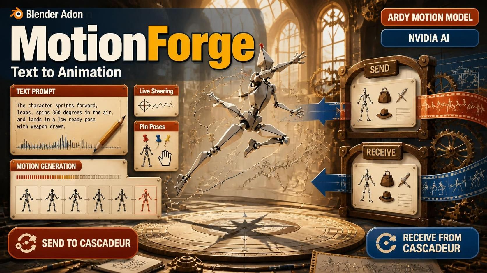

# 🦴 NovaBone Dynamics

**Bone-chain physics simulation add-on** — turn hair, tails, skirts,
accessories and jiggle bones into automatic physics animation with a
few clicks.

**Author: Chamiseul**

🇺🇸 English | [🇰🇷 한국어](./)

---

## ✨ Features

- ✅ Pick a chain's start & end — simulation just works
- ✅ Scale-independent: identical motion on 1.0 Blender rigs and 0.01
  Unreal-import rigs
- ✅ Tune collision visually with live shaper overlays
- ✅ **Shape-accurate collision**: Capsule / Cylinder / Box are probed as
  real volumes (not just visuals) with multi-contact resolution and
  sweep CCD anti-tunnelling
- ✅ **Stable contacts**: anti-fold (no bone ever snaps inside-out) and
  anti-kink (draped chains relax smoothly instead of zig-zagging)
- ✅ Chain mode + Spring (jiggle) mode
- ✅ Works as a collider for Blender cloth & hair sims
- ✅ Bake to keyframes for game-engine export


*▲ The NovaBone N-panel — every setting lives in this one place*

---

## 📥 Installation

1. Select the **files inside** the `novabone` folder and compress them to a zip
   > ⚠️ Do NOT compress the folder itself — `blender_manifest.toml` must be
   at the zip root.
2. Blender → `Edit > Preferences > Get Extensions`
3. Top-right `▼` → **Install from Disk** → pick the zip
4. **Enable** NovaBone
5. In the 3D viewport press `N` → a **NovaBone** tab appears

**Supported**: Blender 4.2+ (tested on 5.0 / 5.2 LTS)

---

## 🚀 Quick Start (5 minutes)


*▲ Select bones → create chains → play. That's it.*

1. Select the armature, enter **Pose Mode**
2. Select the bones you want to simulate
   (for a connected tail: **click the ROOT bone last**, Shift+click the rest)
3. N-panel → **Setup Tools** → `Chains from Selection`
4. The bones sag slightly — success! Press **Spacebar** to play
5. Move a body bone — the chain follows with physics 🎉

> 💡 **Shake & Play** kicks the bones AND starts playback automatically.
> If they jiggle, the engine is alive.

---

## 🧭 Panel Layout

| Section | Purpose |
|---|---|
| **NovaBone Enabled** | Master switch |
| **NovaSol Solver** | Quality & test tools |
| **Forces** | Gravity & wind |
| **Unit Normalization** | Rig-scale compensation |
| **Setup Tools** | Chain creation |
| **Armature** | Per-object settings |
| **Chains** | Per-chain physics |
| **Bake & Reset** | Bake & reset |

---

## 1️⃣ NovaBone Enabled

The big button at the top. **Physics only runs while ON.** Auto-enabled
when you create a chain. OFF = pure animation playback.

---

## 2️⃣ NovaSol Solver

| Setting | Description | Recommended |
|---|---|---|
| **Substeps** | Physics slices per frame. Higher = smoother, stiffer AND fewer collision artefacts | 8 (10–16 for contact-heavy or fast scenes) |
| **Iterations** | Constraint relaxation passes | 3 |
| **Time Scale** | Physics speed (2 = 2×, 0.5 = slow-mo) | 1.0 |

| Button | Purpose |
|---|---|
| **Simulate 1 Step** | Advance exactly one frame's physics |
| **Shake & Play** | Kick all bones AND start playback. Click again to stop |
| **Diagnostics** | Reports engine status & hidden errors. **Click this first when anything misbehaves** |

> ⚠️ Physics advances **when the frame changes**. Not moving while paused
> is normal.

### 🎯 Collision precision engine (v1.0.0)

NovaSol's collision is no longer a single sphere per bone. Every substep:

1. **Volume probing** — the chain's chosen Shape (Capsule / Cylinder /
   Box) is sampled as a bounded set of sphere probes laid through its
   REAL volume: spine points for capsules, lateral rings for cylinders,
   corner offsets for boxes. Mid-bone leaks through walls and "Box
   pushes round" are gone.
2. **Multi-contact** — up to 3 DISTINCT contacts (normals > 60° apart):
   the deepest at full strength, the others at 60%, so a bone resting
   across a corner seats on BOTH walls instead of rattling on one.
3. **Sweep CCD** — a bone that moved more than half its collision radius
   in one substep gets its PATH tested and is snapped back to the last
   free station. Fast whips no longer tunnel through thin plates.
4. **Anti-fold** — every contact correction is budgeted (max 75% of the
   bone's length per round) and direction-clamped (max 45° per round),
   so a bone can never snap folded inside-out; it slides around the
   surface over a few frames instead.
5. **Anti-kink** — after contacts resolve, each interior bone relaxes
   15% toward its neighbours' average direction (Chain mode only), which
   smooths the zig-zag a draped chain would otherwise keep.
6. **Residual re-check** — any bone whose round was clamped or truncated
   gets one extra query + a small outward push so the round always ends
   OUTSIDE the surface. Clean frames pay none of this cost.

> 💡 All of this is automatic — no new sliders. If the panel's
> `Solve xx ms` climbs, lower Substeps first; probe density already
> covers what extra substeps used to.

---

## 3️⃣ Forces

### Gravity

| Mode | Description |
|---|---|
| **Custom (Normalized)** | Default. Direct vector input (default 0,0,-9.81). Scale-independent feel |
| **Scene Gravity** | Use the scene's gravity setting |
| **Zero** | No gravity |

### Procedural Wind


*▲ Wind ON + playback = constantly swaying hair*

| Setting | Description |
|---|---|
| **Strength** | Wind power (6–10 is clearly visible) |
| **Direction** | Wind direction |
| **Turbulence** | Gust randomness |
| **Noise Scale** | Pattern size — low = big waves, high = fine flutter |

> 💡 Enable wind if you want constant motion from playback alone.

---

## 4️⃣ Unit Normalization ⭐

Solves the classic problem: *"Blender rigs have 1.0 bones, Unreal imports
are 0.01 — the same values never match."* All physics runs in a space
**normalized by the reference bone length (L)**, so identical values
produce identical motion at any rig scale.

| Setting | Description |
|---|---|
| **Auto Detect** | Default. Uses the median chain-bone length. **Leave it alone and you're done** |
| **Manual** | Type the reference length yourself |

**Scale presets**: one click on `Blender 1.0` or `Unreal 0.01`.


*▲ `Median bone length` below shows the auto-detected reference*

---

## 5️⃣ Setup Tools

### Bone Prefix — recommended for game rigs


*▲ All dyn_ bones become chains in one click*

1. Enter a prefix in **Prefix** (default `dyn_`)
2. Click **Chains from Prefix**
3. Every prefixed bone is chained automatically

| Mode | Behavior |
|---|---|
| **Group Chains** | Connected dyn_ bones form one chain (recommended) |
| **Individual Bones** | Each dyn_ bone becomes its own 1-bone chain |

### Chains from Selection

1. Select bones in Pose Mode — **click the ROOT bone last**
2. Click the button

| Mode | Behavior |
|---|---|
| **Auto** | Chain when a path exists, individual chain otherwise (recommended) |
| **Chain to Active** | Only bones parented under the active bone |
| **Individual Bones** | Every selected bone becomes its own chain |

> ✅ **Single bone works**: selecting exactly ONE bone and running this
> creates a 1-bone chain (Start = End = that bone) — no more
> "No chain created" warning. The active (root) bone is also never
> silently dropped in Auto mode anymore.

> 💡 **Many accessories at once**: select all necklace/earring bones and
> run Auto — each becomes an individual chain, all with physics.

### Detect Chains Automatically

Finds leaf bones (no children) and chains the consecutive runs upward —
no rig knowledge needed.

| Button | Purpose |
|---|---|
| **Add Empty Chain** | Manual Start/End workflow |
| **Prune Invalid Chains** | Clean up chains referencing deleted bones |
| **Copy Active Chain Settings** | Copy the active chain's settings to all others |
| **Resolve From Start/End** | Fill a chain from just its Start/End bone names |
| **Select Chain Bones** | Select this chain's bones in the viewport |

---

## 6️⃣ Armature Section

| Setting | Description |
|---|---|
| **Enable Armature** | Physics ON/OFF for this armature |
| **Mute Armature** | Pause |
| **Freeze (Post-Bake)** | Stop physics after baking (preserves result) |
| **Show Bone Shapes** ⭐ | **Collision shaper overlay** |
| **Self Collision** | Chain bones push each other apart |

### Show Bone Shapes ⭐


*▲ Capsules span each bone head-to-tail and move with it. Raising Radius grows the diameter*

**Shapers are NOT new bones** — they visualize each bone's collision volume.

- Choose Capsule / Cylinder / Box
- **Radius** = collision thickness (ratio to bone length — scale-free)
- Pixel-locked to the simulated bones during playback
- In Blender Simulation engine mode, shapers ARE the real collision objects
- In NovaSol mode the chosen shape now also drives the ACTUAL collision
  volume (see Collision precision engine above)

> 💡 Tuning: Show Bone Shapes ON → adjust Radius → where the capsule
> slightly overlaps the body is where collision begins.

---

## 7️⃣ Chains

Expand each chain with its `▼` arrow.

**Chain row header**: `[▼] [name] [🎯 Select] [✓ enable] [🔇 mute] [X]`

> 🎯 **Per-chain Select button** — with 10–20+ chains listed, press a
> row's select button to highlight exactly THAT chain's bones in the
> viewport AND make it the active chain (Preset / Copy Settings then act
> on what you clicked). No more guessing which chain owns which bones.

### 🎵 Motion


*▲ Top: Chain (smooth return) / Bottom: Spring (bouncy overshoot)*

| Type | Description |
|---|---|
| **Chain (Positional)** | Default. Stable positional physics, no overshoot. Gets the anti-kink smoothing pass |
| **Spring (Force)** | **Spring jiggle bone** — bounces and oscillates. Ideal for bags, chest, belly |

| Setting | In Chain | In Spring |
|---|---|---|
| **Stiffness** | Goal-tracking strength | Spring constant k |
| **Damping** | Velocity loss | Velocity resistance c (lower = longer wobble) |
| **Taper Along Chain** | Softer toward the tip (ON recommended) | Same |
| **Influence** | 0 = animation, 1 = physics. **For collision scenes keep this at 1.0** — the visible pose is blended with the raw animation at (1 − influence), so 0.34 shows 66% of the un-simulated (through-mesh) pose | Same |
| **Stretch** | Allowed bone stretch (0.2 = ±10%). **0 recommended for collision scenes** | Same |
| **Gravity / Mass** | Multiplier / weight | Same |

### 📐 Limits

| Setting | Description |
|---|---|
| **Cone Limit** | Max bend angle from the root direction |
| **Per-Axis Limits** | Separate X/Z limits (skirts etc.) |

### 🥚 Bone Collision Shape

| Setting | Description | Recommended (contact scenes) |
|---|---|---|
| **Shape** | Capsule (recommended) / Cylinder / Box — **all three are now shape-accurate in NovaSol** | Capsule |
| **Radius** | Collision thickness (scale-free ratio) | 0.18–0.25 |
| **Enable Collision** | This chain's collision ON/OFF | ON |
| **Margin** | Surface slack added around the radius | 0.02–0.05 |
| **Friction** | Tangential velocity killed on contact | 0.4–0.6 |
| **Bounce** | Reflection on contact | 0.05–0.15 (high bounce re-creates kinks) |

### ⚙️ Collision Engine


*▲ NovaSol collision: moving the arm pushes the hair away from the body*

| Engine | Description |
|---|---|
| **NovaSol (Viewport)** | Built-in solver pushes bones out in real time with volume probing, multi-contact, sweep CCD, anti-fold and anti-kink (see Solver section). **Collide With** = a mesh object or a collection |
| **Blender Simulation** | Shapers become **real Blender collision objects** — cloth & hair sims hit them automatically. Still the maximum-fidelity path for Cloth/Hair interplay |

**Blender Simulation Profile**: Hair (thin shells, low friction) /
Cloth (thick shells, high damping) / Custom

**External Targets**: colliders that are NOT the cloth these bones belong
to — other characters, floors, other garments. Use
`Add GN Collider to Targets` to add the official Collider modifier.

> ⚠️ **Cloth integration order**: ① Show Bone Shapes ON ② add a Cloth
> modifier to the garment ③ check **Cloth Collisions** on the cloth
> ④ play

### 🎈 Floating Head

Simulates the head point of detached bones (`Use Connect` off) too.

| Setting | Description |
|---|---|
| **Simulate Head** | Enable head simulation |
| **Head Stiffness** | Pull back toward the animated position |
| **Head Max Offset** | Max drift from rest (0 = unlimited) |

---

## 8️⃣ Bake & Reset


| Button | Description |
|---|---|
| **Bake NovaBone to Keyframes** | Simulate the playback range and **bake to keyframes** — required before game-engine export. Preroll stabilizes first |
| **Unfreeze All Armatures** | Unfreeze post-bake armatures |
| **Reset Physics (Active)** | Reset the active armature's physics |
| **Reset All Physics** | Reset the whole scene |

---

## 🎨 Presets

| Preset | Feel | Use for |
|---|---|---|
| **Hair** | Soft flowing | Hair |
| **Jelly** | Wobbly | Chunky trinkets |
| **Cloth** | Loose fabric | Scarves, ribbons |
| **Tail** | Rounded swing | Tails |
| **Accessory** | Firm swing | Earrings, necklaces |
| **Antenna** | Barely bends | Antennas, feathers |
| **Jiggle** | Heavy sag & wobble | Chest, belly |
| **Spring** ⭐ | Bouncy overshoot | Spring jiggle bones |

---

## 📋 Recipes

<details>
<summary><b>👱 Hair</b></summary>

1. Select hair bones (root last) → `Chains from Selection`
2. Preset: **Hair**
3. Show Bone Shapes ON → adjust Radius
4. Collision: NovaSol + body mesh, **Influence 1.0**, Bounce 0.1, Margin 0.03
5. Play — the hair should slide off the arm

</details>

<details>
<summary><b>👝 Multiple accessories</b></summary>

1. Select all accessory bones → `Chains from Selection` (Auto)
2. Tune one → **Copy Active Chain Settings**
3. Use each row's 🎯 select button to find which bones belong to which chain

</details>

<details>
<summary><b>🎒 Spring bag</b></summary>

1. Create the bag chain → Preset: **Spring**
2. Shake & Play → check the bounce
3. Raise Damping to settle faster

</details>

<details>
<summary><b>🩳 Skirt</b></summary>

1. `Chains from Prefix` if you use one
2. Preset: **Cloth**
3. Cone Limit 60–70°
4. Self Collision ON (prevents panel overlap)

</details>

<details>
<summary><b>🧵 Cloth integration</b></summary>

1. Engine = **Blender Simulation**, Profile = **Cloth**
2. **Show Bone Shapes ON**
3. Cloth modifier on the garment → check **Cloth Collisions**
4. Play

</details>

<details>
<summary><b>⛓️ Draping a chain over a sphere/body (contact tuning)</b></summary>

1. Influence **1.0**, Stretch **0**
2. Bounce **0.05–0.15**, Friction **0.4–0.6**, Margin **0.03**
3. Radius 0.18–0.25, Substeps 12
4. Play — the chain should drape and slide, no folding, no kinks

</details>

---

## 🔧 Troubleshooting

<details>
<summary><b>Physics doesn't move at all</b></summary>

1. NovaBone Enabled / Enable Armature are ON
2. Freeze is OFF
3. **Is playback running?** (paused = physics paused — by design)
4. Click Shake & Play — if it jiggles, the engine is fine
5. Diagnostics → check the System Console

</details>

<details>
<summary><b>NovaSol collision doesn't block</b></summary>

1. Enable Collision ON + body mesh assigned
2. **Sim Influence at 1.0** — at lower values the visible pose is
   blended back toward the raw animation, which may pass through the mesh
3. Radius 0.2–0.3, Margin 0.02–0.05
4. Check for red `Collider failed: name` at the panel bottom
5. Fast motion → Substeps 10–16 (sweep CCD also engages automatically)

</details>

<details>
<summary><b>A few bones fold / collapse at the contact zone</b></summary>

1. Update to the v1.0.0 solver (anti-fold + anti-kink built in)
2. Bounce down to 0.1, Friction to 0.4–0.6
3. Substeps 10–16 — shallower per-step sinks mean the fold guards
   rarely engage and motion stays smooth
4. Reset Physics after changing settings

</details>

<details>
<summary><b>Cloth doesn't collide</b></summary>

1. Show Bone Shapes ON
2. Check **Cloth Collisions** on the cloth modifier
3. Engine = Blender Simulation + Profile = Cloth

</details>

<details>
<summary><b>Bones snap / drift away</b></summary>

1. **Remove constraints (IK etc.) from simulated bones**
2. Reset Physics
3. Avoid non-uniform object scale

</details>

<details>
<summary><b>Fix Bones (orientation) crashes or does nothing</b></summary>

1. v1.0.0+ handles bones whose child sits exactly ON the bone's head
   (Unreal base_X/dyn_X pairs) — they are reported as
   "child sits on the bone's head (left alone)" instead of crashing
2. Use **Check** first — it lists how many bones are off and why
   any were skipped

</details>

---

## ❓ FAQ

**Q. What are the NovaShape_* objects?**
Collision-volume visualizations. They're removed when Show Bone Shapes is
turned off and always hidden from renders.

**Q. How do I get this into a game engine?**
`Bake NovaBone to Keyframes`, then export FBX. Game engines replay the
baked animation.

**Q. Performance with the new collision?**
Volume probing is bounded (≤ ~16 sphere queries per bone per target,
multi-contact and CCD only cost extra ON contact frames). Watch the
per-chain solve time (ms) at the panel bottom; if it climbs, lower
Substeps — probe density already covers what extra substeps used to.

**Q. Single-bone accessories?**
Yes — `Chains from Selection` with exactly one bone now creates a 1-bone
chain directly. Or use Individual mode, or enable Include Single Bones in
Detect Chains.

**Q. Which chain owns which bones?**
Press the 🎯 button on that chain's row — its bones light up in the
viewport and it becomes the active chain.

---

## 📜 License

```
GNU GENERAL PUBLIC LICENSE
Version 3, 29 June 2007
```

This project is licensed under **GPL-3.0**, the standard Blender license.
See the [LICENSE](./LICENSE) file for the full text.

---

**Made by Chamiseul** 🦴